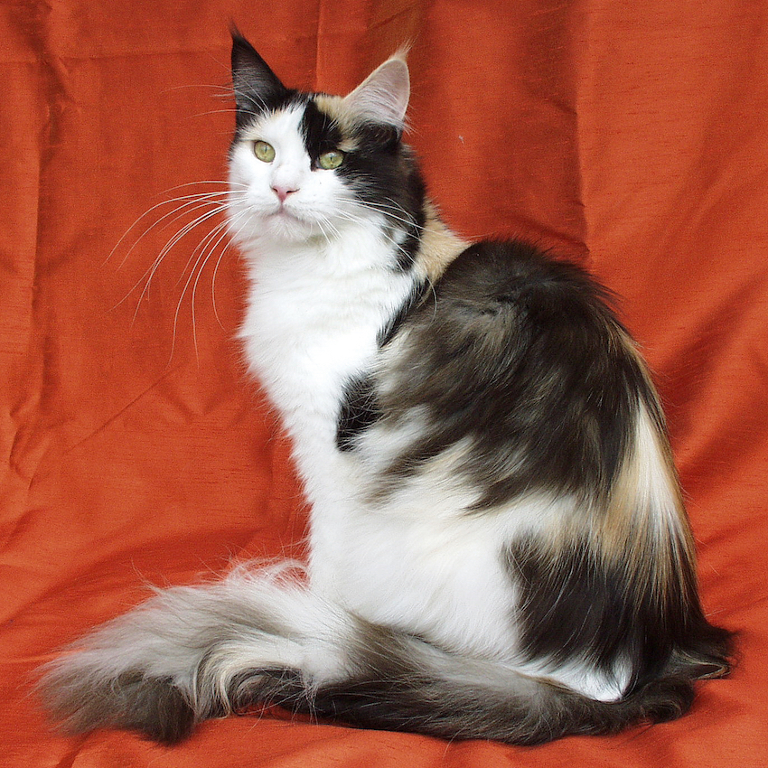

# Cats

Cats are very common, however, most people can not identify or differentiate between different cat breeds. According to various organizations and associations *(see cat wiki link below)*, there are between 45 and 73 recognized cat breeds.

## Partial List Of Cat Breeds

- Exotic Shorthair
- Foldex
- German Rex
- Havana Brown
- Highlander
- Himalayan Persian
- European Shorthair
- Egyptian Mau
- Japanese Bobtail
- Javanese or Colorpoint Longhair
- Kanaani
- Khao Manee
- Kinkalow
- Korat
- Korean Bobtail
- Korn Ja
- Kurilian Bobtail or Kuril Islands Bobtail
- Lambkin
- LaPerm
- Lykoi
- Maine Coon
- Manx
- Mekong Bobtail

### Attributions

[Cat Wiki](https://en.wikipedia.org/wiki/List_of_cat_breeds)
  - [Cat Image](https://en.wikipedia.org/wiki/List_of_cat_breeds#/media/File:Maine_Coon_female.jpg) by [Mueller-rech.muenchen](https://commons.wikimedia.org/wiki/User:Mueller-rech.muenchen)